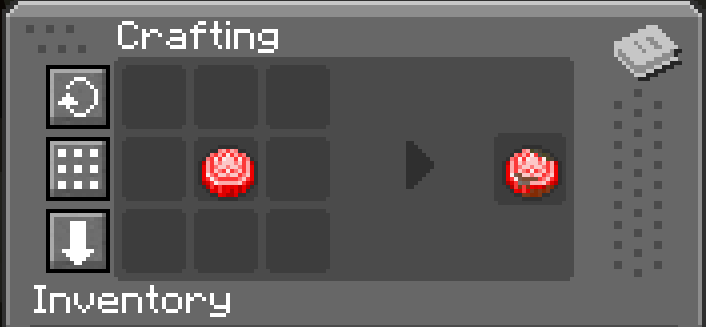

# cobblemon-rusty-bottlecaps

This is a Minecraft mod which extends Cobblemon and the `cobblemon-unimplemented-items` mod by [tnetcalfe89](https://github.com/tmetcalfe89) (for more info: [CREDIT](./CREDIT)).

## Features

This mod adds Rusty Bottle Caps to change all the different IVs of your Pokémon to 0.

Rusty bottle caps can be crafted quite easily. They are one-to-one interchangeable with the bottle caps from `cobblemon-unimplemented-items`.




## Installation

- Modrinth
  - TODO
- GitHub
    - TODO
- Building from source
  - Run `./gradlew build`
  - JAR (e.g. `cobblemon-rusty-bottlecaps-1.0.0.jar`) will be build in `build/libs`

## Testing

To run the client locally to see if stuff works run
```bash
./gradlew runClient
```
